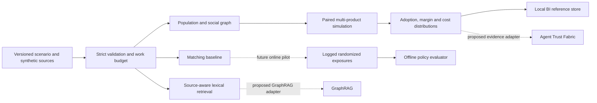

# Audience Swarm Lab

**A reproducible synthetic audience and product-offer experiment kernel.** It is the first inspectable slice of an intended audience intelligence stack: a synthetic environment, a product matching baseline, source-aware context retrieval, logged-policy evaluation, and per-experiment cost accounting. The reference case is entirely synthetic and runs offline with Python 3.11+ and no runtime dependencies.

It does **not** predict a real market, use live customer data, connect to Jev, build a GraphRAG index, operate an Iceberg lakehouse, or provide production recommendations. Those integrations have explicit contracts and release gates in [the architecture](docs/ARCHITECTURE.md). The project deliberately separates `SYNTHETIC_SCENARIO` outputs from measured lift.

## Run the first vertical

```bash
python3 -m audience_swarm_lab.cli simulate fixtures/offer-comparison.json --output /tmp/offer-result.json
python3 -m audience_swarm_lab.cli rank fixtures/offer-comparison.json --segment budget
python3 -m audience_swarm_lab.cli evaluate fixtures/logged-policy.json
python3 -m audience_swarm_lab.cli warehouse /tmp/offer-result.json --db /tmp/audience-lab.sqlite
python3 -m unittest discover -s tests -v
```

The fixture compares two software products over 400 synthetic agents, eight steps, 50 paired runs, and three arms: baseline, a basic-product discount, and a pro-product quality investment. The experiment uses the same sampled agents and random draws in each arm. It reports adoption, product choices, gross and net contribution, marketing cost, trajectories, paired effects, and 5th/95th **run quantiles**. These quantiles are variation inside the model, not real-world confidence intervals.

At version 0.1.0, the fixture produces 480,000 agent-steps. Its modeled average net contribution is about **$14,276** for baseline, **$13,297** for the discount, and **$14,654** for the quality arm. The dollar sign comes from the fixture's hypothetical product prices and costs. No historical audience data calibrated these numbers.

The optional cost meter estimates **$0.25688 per scenario** from the fixture's illustrative CPU, graph-index allocation, storage/observability, and operating allowance assumptions. It excludes model-provider calls, human review, hosting overhead beyond the allowance, and sales/support. It is a meter example, not a cloud-price claim.

## What is implemented

| Component | Current capability | Boundary |
| --- | --- | --- |
| Scenario contract | Strict validation of population, segments, products, arms, source documents, and work cap | Python validator is authoritative in v0.1 |
| Synthetic world | Heterogeneous segments, ring social network, competing products, one purchase per agent | Simplified behavioral equations, no calibration |
| Experiments | Reproducible seeded runs, common random draws, paired effects, run quantiles | Scenario comparisons, not causal estimates |
| Context | Source- and license-preserving lexical retrieval | BM25 control arm; GraphRAG is future work |
| Matching | Eligibility-limited model-value ranking | Uncalibrated heuristic, no real uplift model |
| Offline evaluation | Self-normalized inverse-propensity estimate | Requires valid logged propensities and overlap |
| Unit economics | Work units and explicit assumed rates | Excludes external provider and review costs |
| Continuous BI reference | Idempotent SQLite store for arm means and paired effects | Local analysis only; Iceberg is a future adapter |

## Architecture



The [architecture specification](docs/ARCHITECTURE.md) gives the data model, proposed Jev/GraphRAG/Iceberg integration boundaries, evaluation gates, and commercialization boundary. The [benchmark protocol](docs/BENCHMARKS.md) defines how to test whether added swarm complexity improves decisions over simple baselines.

## Ecosystem relationship

- [audience-twin](https://github.com/AAH20/audience-twin) is an existing agent-based market simulator and a benchmark/adapter candidate. This repository currently runs its own independent reference model; it does not import audience-twin.
- [Agent Trust Fabric](https://github.com/AAH20/agent-trust-fabric) is the future scenario/decision receipt target. There is no live bridge yet.
- [GRC_Claw](https://github.com/AAH20/GRC_Claw) is the future governance-evidence target. There is no live bridge yet.
- [TypeSafe Jev](https://docs.typesafe.ai/introduction), [Microsoft GraphRAG](https://microsoft.github.io/graphrag/), and [Apache Iceberg](https://iceberg.apache.org/docs/latest/) are optional future integration targets. Their licenses, API terms, and deployment costs remain separate from this MIT reference package.

## License

MIT. The synthetic fixtures contain no customer data. No upstream code is copied into this repository.
