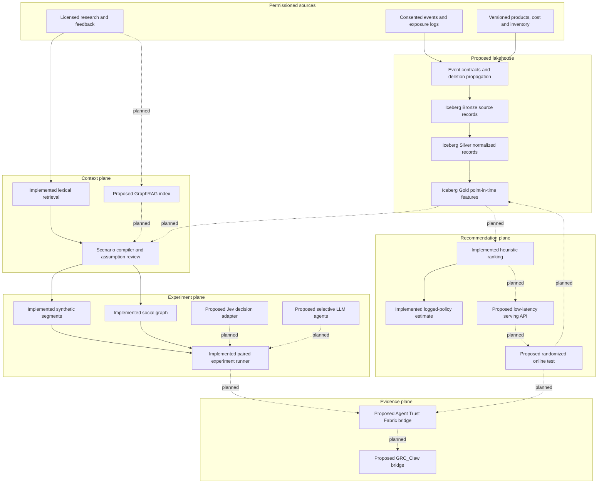
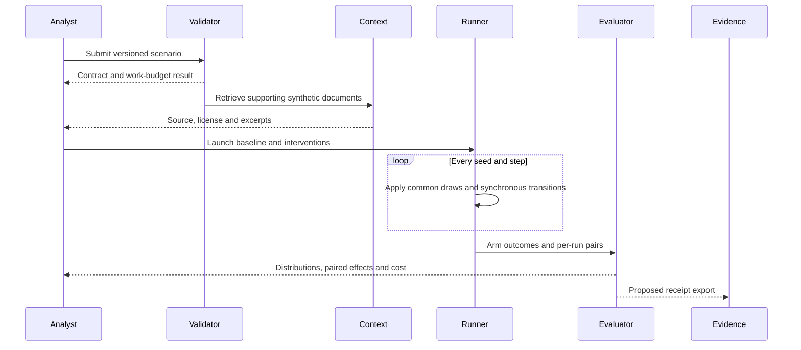

# Architecture and implementation gates

The long-term product is an audience decision laboratory, not a “predict anything” engine. Simulation is for hypothesis generation and stress testing. Recommendation lift must be demonstrated with consented outcomes and controlled experiments. Version 0.1 implements the shaded reference path below; the remaining components are planned interfaces, not live integrations.

## System planes

**Version 0.1:** The JSON scenario is validated, a source-aware lexical control arm returns citations, synthetic agents are sampled by segment, and all arms share the same draw stream per run. Each agent can purchase one of multiple competing products or nothing. Peer ownership affects next-step utility. The output includes product counts, adoption trajectories, gross contribution, marketing cost, net contribution, paired effects and an illustrative cost estimate.

The included SQLite BI reference ingests result JSON idempotently by scenario digest and exposes arm-level net contribution and paired effects. It rejects results labeled as anything other than synthetic. It demonstrates the result contract and repeatable reporting on one machine; it is not a distributed, continuously ingesting Iceberg implementation.

**Intended data plane:** Each observed event should carry tenant, pseudonymous subject, event time, ingest time, consent purpose, source, product, event type and schema version. Exposure events also need candidate set, chosen order, policy version and selection propensity. Product snapshots need effective time, price, unit cost, inventory and eligibility. Iceberg snapshots should fix the data state used for backtests and support deletion propagation. No production data plane exists in this release.

**Intended context plane:** Preserve document owner, license, valid time, source ID, content hash and citation span. A scenario compiler should present extracted assumptions and conflicting evidence for review before freezing a run. The current BM25 retrieval is a baseline; it does not infer facts, build a graph, or validate claims.

**Intended agent-policy interface:** `decide(state, candidates, budget) -> choice, probabilities, model_version, usage`. The deterministic reference model remains a control arm. A Jev adapter would handle bounded typed questions, while selective generative policies would handle a small number of complex turns. Provider outputs never authorize real-world actions by themselves. The current reference engine does not call either provider.

## Scenario lifecycle

## Recommendation path

Only a segment-level heuristic ranking and a self-normalized inverse-propensity evaluator are implemented. The serving API, calibrated models, uplift models, candidate indexes, exploration and online experiment service remain milestones. Synthetic labels must not be treated as production ground truth.

## Public contracts to freeze next

| Entity | Required fields | Invariant |
| --- | --- | --- |
| `ScenarioManifest` | scenario ID, data cutoff, source snapshot IDs, products, interventions, seeds, model versions, budget | Frozen before scoring |
| `EvidenceSource` | source ID, owner, license, valid time, digest, citation span | Every external assumption traceable |
| `ObservedEvent` | pseudonymous subject, consent purpose, event time, ingest time, product, event, schema version | No future leakage into past features |
| `Exposure` | context, candidate set, selected action, policy version, propensity | Positive known propensity for off-policy scoring |
| `Outcome` | exposure ID, observation window, purchase, return, retention, margin | Delayed outcomes linked to exposure |
| `AgentDecision` | run ID, agent ID, step, state digest, alternatives, choice, usage | Reproducible or explicitly stochastic |
| `ExperimentResult` | arm, metric, seeds, paired effects, run quantiles, evidence label | Synthetic and measured outputs never conflated |

## Release gates

1. **Reference engine:** deterministic replay, no-op arm exactly zero, bounded work, synthetic fixture, local BI ingestion, CI. Implemented.
2. **Evidence-grounded scenarios:** licensed-source ingestion, temporal cutoff, GraphRAG adapter, citation span tests and human assumption review.
3. **Hybrid swarm:** versioned policy interface, Jev/LLM adapters, model-call budget, fallbacks, trace capture and comparison with deterministic control.
4. **Observed-data validation:** consented datasets, point-in-time joins, time-split holdouts, calibration, naive and audience-twin baselines.
5. **Matching pilot:** eligibility, candidate retrieval, calibrated ranking, propensity logging, offline policy evaluation and randomized online test.
6. **Governed operations:** authenticated source receipts, tenant isolation, deletion tests, monitoring, incident response and GRC_Claw mapping.

The intended commercial layer is hosted connectors, managed private data, scalable experiment scheduling, enterprise controls, validated domain packs and support. The OSS layer keeps contracts, reference engine, evaluation methods, synthetic fixtures, and cost-meter formulas inspectable. Any “better than MiroFish” or “better than social platforms” claim requires task-specific external evidence under the benchmark protocol.
